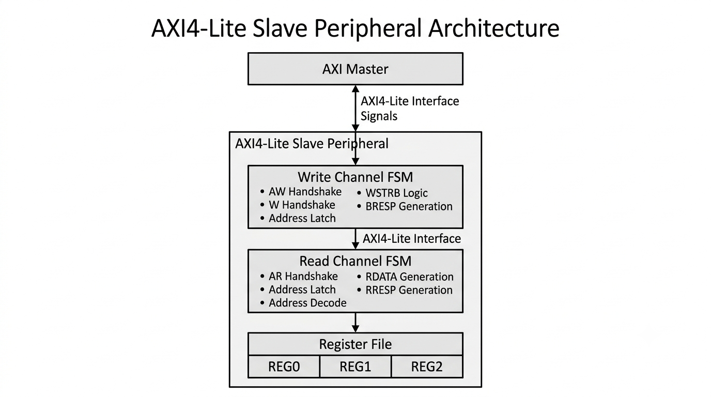
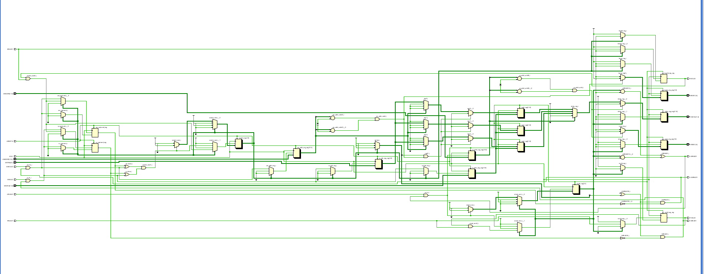
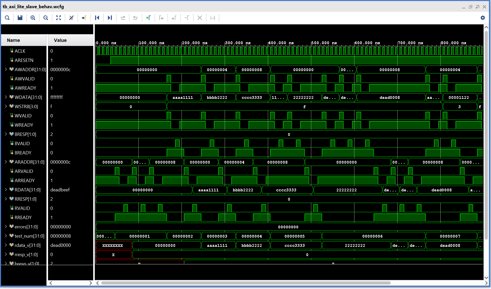

# AXI4-Lite Slave Peripheral in Verilog

A standalone implementation of an **AXI4-Lite Slave Peripheral** written in **Verilog**. The project is designed for RTL design learning and interview preparation, demonstrating the implementation of the AXI4-Lite protocol using finite state machines (FSMs) along with a simple self-checking Verilog testbench.

---

## Features

- Verilog-2001 implementation
- Standalone AXI4-Lite Slave Peripheral
- 32-bit Address Bus
- 32-bit Data Bus
- Three memory-mapped 32-bit registers
- Independent Read and Write FSMs
- Correct VALID/READY handshake implementation
- Supports independent AW and W channel arrivals
- Byte-enable writes using `WSTRB`
- OKAY and SLVERR response generation
- Self-checking Verilog testbench
- Directed protocol verification (No UVM)

---

## Repository Structure

```
axi-lite-slave-verilog/
│
├── rtl/
│   └── axi_lite_slave.v
│
├── tb/
│   └── tb_axi_lite_slave.v
│
├── docs/
│   └── block_diagram.png
│
├── results/
│   ├── rtl_schematic.png
│   └── simulation_waveform.png
│
├── README.md
├── LICENSE
└── .gitignore
```

---

## Architecture

The AXI4-Lite Slave consists of two independent finite state machines.

- **Write FSM**
  - Handles AW, W and B channels
  - Supports independent arrival of write address and write data
  - Performs register write operations
  - Generates write response

- **Read FSM**
  - Handles AR and R channels
  - Latches read address
  - Reads register contents
  - Generates read response

The slave contains a simple memory-mapped register file consisting of three 32-bit registers.

### Block Diagram

<p align="center">

</p>

---

## Register Map

| Address | Register | Access |
|----------|----------|--------|
| 0x00 | REG0 | Read / Write |
| 0x04 | REG1 | Read / Write |
| 0x08 | REG2 | Read / Write |

---

## AXI4-Lite Interface Signals

| Channel | Signal | Description |
|---------|---------|-------------|
| **Global** | `ACLK` | Global clock |
| | `ARESETn` | Active-low reset |
| **Write Address** | `AWADDR` | Write address |
| | `AWVALID` | Write address valid |
| | `AWREADY` | Slave ready to accept write address |
| **Write Data** | `WDATA` | Write data |
| | `WSTRB` | Write byte strobes |
| | `WVALID` | Write data valid |
| | `WREADY` | Slave ready to accept write data |
| **Write Response** | `BRESP` | Write response |
| | `BVALID` | Write response valid |
| | `BREADY` | Master accepts write response |
| **Read Address** | `ARADDR` | Read address |
| | `ARVALID` | Read address valid |
| | `ARREADY` | Slave ready to accept read address |
| **Read Data** | `RDATA` | Read data |
| | `RRESP` | Read response |
| | `RVALID` | Read data valid |
| | `RREADY` | Master accepts read data |

> **Note:** Every AXI4-Lite channel operates independently using the VALID/READY handshake. A transfer occurs only when both `VALID` and `READY` are asserted during the same clock cycle.

---

## Design Highlights

- Two independent finite state machines for read and write transactions.
- Supports independent arrival of Write Address (AW) and Write Data (W) channels.
- Implements proper AXI4-Lite VALID/READY handshake protocol.
- Supports byte-level writes using `WSTRB`.
- Implements memory-mapped register access.
- Returns `OKAY` for valid transactions and `SLVERR` for invalid accesses.

---

## Verification

A simple self-checking Verilog testbench is included.

The verification environment intentionally avoids:

- UVM
- Assertions
- Functional Coverage
- Scoreboards
- Monitors
- Drivers
- Agents

Instead, it uses two reusable tasks:

- `axi_write()`
- `axi_read()`

to perform AXI4-Lite transactions.

---

## Directed Test Cases

The following protocol tests are implemented:

- Reset Test
- Write REG0
- Write REG1
- Write REG2
- Overwrite Register Test
- Write All Registers
- Partial Write Test (`WSTRB`)
- Invalid Address Test
- Back-to-Back Writes
- Back-to-Back Reads
- Independent AW and W Arrival Test

Each test automatically reports **PASS** or **FAIL**.

---

## Simulation Results

Simulation confirms:

- Correct VALID/READY handshaking
- Successful write transactions
- Successful read transactions
- Correct address decoding
- Proper write response generation
- Proper read response generation
- Correct `WSTRB` functionality
- Independent handling of AW and W channels

### RTL Schematic

<p align="center">

</p>

### Simulation Waveform

<p align="center">

</p>

---

## Skills Demonstrated

- Verilog RTL Design
- Finite State Machine (FSM) Design
- AMBA AXI4-Lite Protocol
- Memory-Mapped Peripheral Design
- Register File Design
- Address Decoding
- Byte Enable (`WSTRB`) Handling
- RTL Verification
- Self-Checking Testbench Development
- Digital System Design

---

## Future Improvements

Possible extensions include:

- Parameterizable number of registers
- Parameterizable address and data widths
- Interrupt generation
- AXI4-Full interface implementation
- Formal protocol verification
- SystemVerilog assertion-based verification

---

## License

This project is released under the MIT License.
